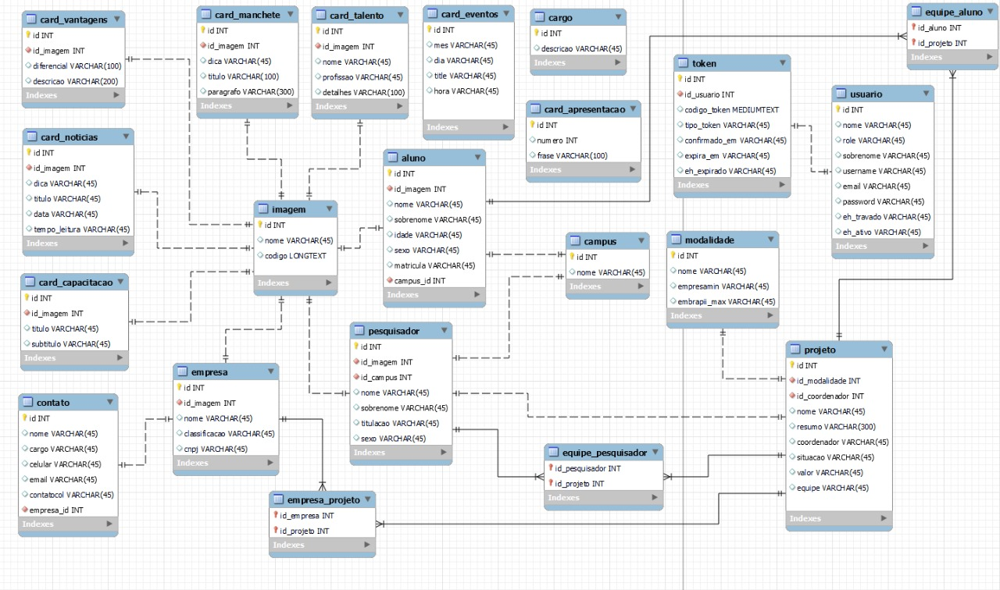
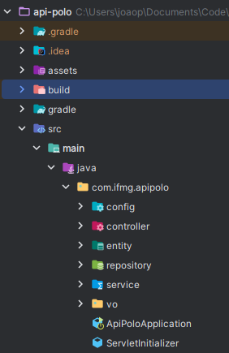

# Novo Site do Polo de Inovação do IFMG

`REST API Java Spring Boot` do aplicativo desenvolvido em Vue como meu Trabalho de Conclusão de Curso para o Instituto Federal de Minas Gerais, minha proposta foi de criarmos um site onde os textos dos componentes assim como as imagens sejam plenamente editáveis, neste projeto foram aplicados `Javascript`, `TailwindCSS`, `Vue.js`, também usei bastante uma biblioteca de componentes chamada `FlowbiteUI`, que consome `TailwindCSS` pra construções dos componentes, a aplicação também é `responsiva` com uma série de requisições assíncronas via `Axios` construída em cima de `componentes acessíveis` e `manipulação de DOM`.

# Executando...

### Banco de Dados Mapeado

### Arquitetura

# Autores

João Pedro Souza
